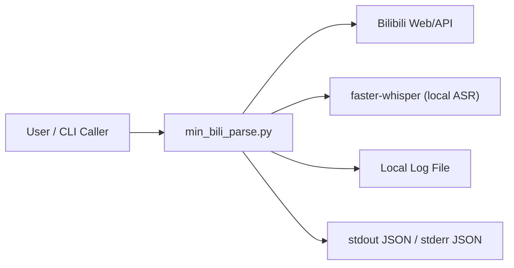
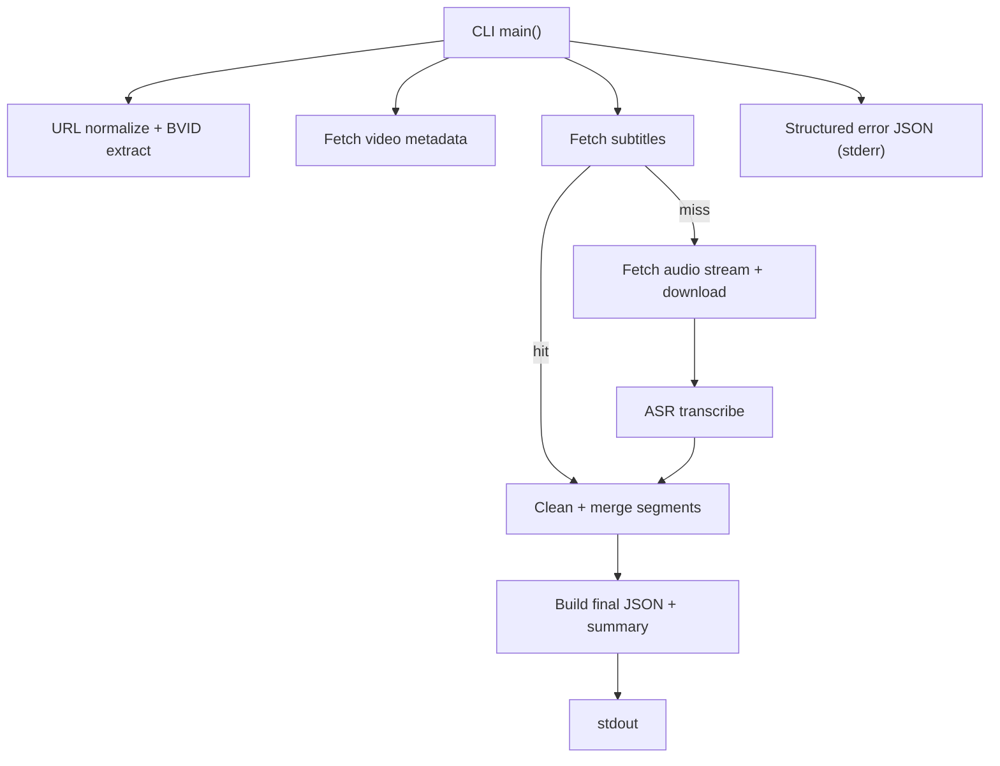

# bili-standalone-parser

一个用于解析 Bilibili 视频链接并输出结构化 JSON 文本的技能项目。当前仓库核心内容位于 `skills/bili-standalone-parser/`。

## Skill 解读

`bili-standalone-parser` skill 的目标是提供一个可独立运行的 Python 解析脚本，具备以下行为：

- 输入：Bilibili 视频 URL（支持标准链接与 `b23.tv` 短链）
- 优先策略：优先拉取字幕，字幕缺失时自动回退到 ASR
- 输出：稳定 JSON 字段（`bvid`, `title`, `source`, `language`, `full_text`, `summary`, `warnings`）
- 错误约定：失败时在 `stderr` 输出机器可读错误 JSON（含 `code`, `message`, `stage`）

## System Context Diagram



## Component Diagram



## Installation

1. 确保使用 Python 3.10+。
2. 安装依赖：

```bash
pip install -r skills/bili-standalone-parser/scripts/requirements.txt
```

## 5-Minute Quick Start

```bash
python skills/bili-standalone-parser/scripts/min_bili_parse.py "https://www.bilibili.com/video/BVxxxxxxxxxxx"
```

成功时输出示例（`stdout`）：

```json
{
  "bvid": "BVxxxxxxxxxxx",
  "title": "示例标题",
  "source": "subtitle",
  "language": "zh-CN",
  "full_text": "...",
  "summary": "...",
  "warnings": []
}
```

## Configuration Options

CLI 参数：

- `url`：必填，Bilibili 视频链接
- `--sessdata`：可选，覆盖环境变量中的 `BILI_SESSDATA`

常见运行方式：

```bash
# 使用 SESSDATA
python skills/bili-standalone-parser/scripts/min_bili_parse.py "<url>" --sessdata "<SESSDATA_VALUE>"

# 使用本地代理
HTTP_PROXY=http://127.0.0.1:7890 \
HTTPS_PROXY=http://127.0.0.1:7890 \
ALL_PROXY= \
python skills/bili-standalone-parser/scripts/min_bili_parse.py "<url>"

# 控制 ASR 预热和模型
ASR_WARMUP=1 ASR_MODEL=whisper-small \
python skills/bili-standalone-parser/scripts/min_bili_parse.py "<url>"
```

## Environment Variables Reference

| Name | Default | Purpose |
|---|---|---|
| `BILI_COOKIE` | empty | 完整 Cookie 头 |
| `BILI_SESSDATA` | empty | SESSDATA 值（无 `--sessdata` 时使用） |
| `USE_ENV_PROXY` | `1` | 是否信任 `HTTP_PROXY/HTTPS_PROXY/ALL_PROXY` |
| `HTTP_PROXY` | empty | HTTP 代理 |
| `HTTPS_PROXY` | empty | HTTPS 代理 |
| `ALL_PROXY` | empty | 通用代理 |
| `ASR_WARMUP` | `1` | 启动时是否预热/下载 ASR 模型 |
| `ASR_MODEL` | `whisper-small` | ASR 模型名（支持别名映射） |
| `HTTP_TIMEOUT_SEC` | `12.0` | 上游请求超时秒数 |
| `TEMP_DIR` | `/tmp` | 音频临时文件目录 |
| `MAX_AUDIO_MB` | `200` | 音频下载上限（MB） |
| `LOG_LEVEL` | `INFO` | 日志级别 |
| `LOG_FILE` | `skills/bili-standalone-parser/scripts/logs/min_bili_parse.log` | 日志文件路径 |
| `HF_HOME` | empty | `faster-whisper` 模型缓存目录 |

## Troubleshooting

- `UPSTREAM_CONNECT_FAILED`：先检查网络、DNS、代理配置与 Bilibili 可达性。
- `UPSTREAM_RATE_LIMIT`：上游限流，建议重试并降低请求频率。
- `VIDEO_NOT_FOUND`：确认 BV 号是否存在、链接是否正确。
- `ASR_FAILED`：确认 `faster-whisper` 安装成功，模型可下载或本地缓存可用。
- `AUDIO_FETCH_FAILED`：检查页面解析与音频下载链路，必要时调整代理与超时。

## What to do if this fails

1. 先最小化验证：
   - 运行 `python skills/bili-standalone-parser/scripts/min_bili_parse.py "<url>"`。
2. 如果报网络错误：
   - 清理/修正代理变量，或指定可用代理后重试。
3. 如果报 ASR 错误：
   - 安装依赖并确认模型缓存目录可写；必要时设置 `HF_HOME`。
4. 查看日志：
   - 打开 `skills/bili-standalone-parser/scripts/logs/min_bili_parse.log` 定位阶段性失败点。
5. 若仍失败，记录 `stderr` 返回的 `code/message/stage` 作为复现依据。
